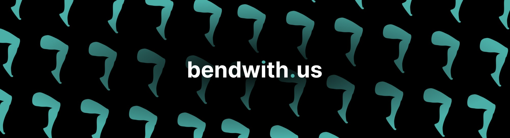

**Home rehab that bends with you.** An AI physical-therapy coach: the patient does their prescribed
exercise in front of any webcam or phone camera, the app measures the joint angle to the degree,
counts reps out loud, stops when it hurts, and sends the therapist numbers instead of guesses. The
therapist sees every patient's range-of-motion trend, replays any session, watches live, and approves
an AI-drafted change to the plan.

Between clinic visits nobody measures the joint. This does.

**Live:** [bendwith.us](https://bendwith.us) (the demo buttons log in as a patient or the therapist, no sign-up needed).

## What it does

| For the patient | For the therapist |
| --- | --- |
| Knee, hip, shoulder, elbow or wrist, one seated exercise each | Caseload dashboard: adherence, best angle, latest pain, red flags |
| Camera setup that checks itself (placement, framing, light) | Range-of-motion chart per joint from real angle data |
| Live tracking with a rep counter, target marker and form faults | Session replay at 10 Hz, rep-by-rep peaks, time held at end range |
| A voice coach that counts, encourages, and says stop | Live view of a session in progress (angles only, no video) |
| Spoken pain check-in: say the score, hear the reply | Plan suggestion drafted by Gemini, checked by clinical rules, approved by you |
| Weekly recap read aloud, English or Spanish | Weekly summary written by Gemini from the session data |
| Same app on the web, iPhone and Android | Sign in with email or Google; a row-level access rule shows only your patients |

## Privacy and control of the AI

- **Video never leaves the device.** Pose tracking runs on the phone or laptop; only joint angles,
  rep counts and pain scores are sent. Spoken pain answers are transcribed once and never stored.
- **The AI drafts, a person decides.** Gemini proposes a plan change citing the patient's own
  numbers, clinical rules can veto it and say why, and nothing reaches the patient until the
  therapist approves it.
- **The patient can always stop.** Saying "it hurts" ends the exercise at once, whatever the coach
  was doing.
- **No chat window.** The core experience is doing the exercise; the AI works behind it.

## How it is built

```
frontend/   React 19 + Vite + Tailwind. MediaPipe Pose runs in the browser: video never leaves the device.
mobile/     The same build wrapped with Capacitor 8 for iOS and Android (model shipped in the app).
backend/    FastAPI. Auth (JWT, email or Sign in with Google), data routes, live sessions (WebSocket in, SSE out), AI routes, voice.
database/   Tiger Data (PostgreSQL + TimescaleDB): schema, demo data, the SQL behind every endpoint.
ml/         The angle prototype and accuracy validation notes.
scripts/    Pre-generates the coach's voice clips; smoke-tests a deployed backend.
docs/       Auth rules, the Devpost text, the pitch.
.do/        DigitalOcean App Platform spec: the API service and the static site.
```

### Sponsor technology, and exactly where it runs

| | Where | What it does |
| --- | --- | --- |
| **Gemini API** | `backend/api/services/*`, `backend/api/data/plan_suggestion.py`, `backend/api/prompts/` | Plan suggestion with structured output and a rules layer that can override it; weekly summary; weekly recap; pain-check reply; pain-voice extraction (score, symptoms, note from a transcript); translation. Every call has a template fallback so the demo never 500s. |
| **ElevenLabs** | `scripts/generate_audio.py`, `backend/api/services/tts_service.py`, `backend/api/services/stt_service.py`, `frontend/src/lib/coach.ts` | 130 pre-generated multilingual cue clips (`eleven_multilingual_v2`), streaming replies that play before synthesis finishes (`eleven_flash_v2_5`), Scribe speech-to-text for the spoken pain check. One voice speaks both languages. |
| **Tiger Data** | `database/sample_data/schema.sql`, `backend/api/data/queries.py`, `backend/api/data/storage.py` | Every angle frame of every session in an `angle_samples` hypertable; a real-time continuous aggregate (`session_angle_1m`) the plan suggestion reads; `time_bucket` at 100 ms, 1 min and 1 day; columnstore compression on chunks older than a day (about 11 to 1 on the demo data); the access rule as one SQL function. The clinic dashboard's Data card shows the live numbers. |
| **DigitalOcean** | `.do/app.yaml` | The API on App Platform (single instance, in-memory live hub) and the web app as a static site on bendwith.us. |
| **GoDaddy Registry** | bendwith.us | The `.us` zone is run by GoDaddy Registry. |

## Run it

Backend, from the repo root (needs `.env`, see `.env.example`; demo accounts in [docs/AUTH.md](docs/AUTH.md)):

```bash
python -m venv .venv && source .venv/bin/activate
pip install -r backend/requirements.txt
python database/sample_data/load_to_tiger.py        # schema + demo data into Tiger Data
cd backend && uvicorn api.main:app --reload         # http://localhost:8000/api/v1
```

Web app (`VITE_USE_MOCKS=true` in `frontend/.env` runs the whole UI with no backend):

```bash
cd frontend && cp .env.example .env && npm install && npm run dev
```

Sign-in options (all optional, see [docs/AUTH.md](docs/AUTH.md)): `GOOGLE_CLIENT_ID` in `.env` and
`VITE_GOOGLE_CLIENT_ID` in `frontend/.env` turn on "Continue with Google"; `OTP_REQUIRED=true` adds an
email code step to sign-up (off by default, and it needs an email provider or `OTP_DEV_MODE=true`).

Tests: `pip install pytest && cd backend && python -m pytest` (no database, Gemini or ElevenLabs
needed; the tests can't reach a database unless asked). Three more need the database in
`DATABASE_URL`, and two of them write to it: `RUN_DB_TESTS=1` turns them on, so point it at a
scratch database, not the live demo. Smoke-test a deployment:
`python scripts/smoke_test.py <url>`.
Phone apps: see [mobile/README.md](mobile/README.md).

Rehearsing on the live app leaves rows behind (a session from a camera test, a plan left on
another joint). Before a demo, put the demo data back to the seed:

```bash
python scripts/reset_demo_data.py         # report what is extra, change nothing
python scripts/reset_demo_data.py --yes   # remove the extras, restore the plans
```

## Team

Built at ShellHacks 2026 by Daniel, Luis, Satyabrata and Shan.
